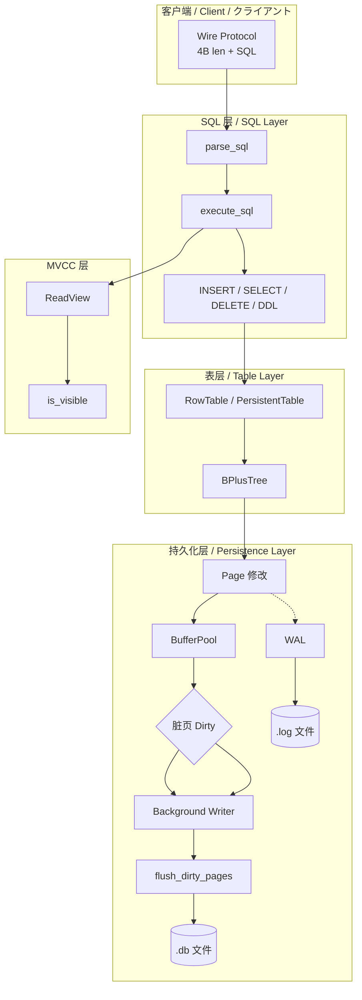

# PyBPlus-DBEngine

<p align="center">
  <strong>A production-ready embedded SQL database engine powered by B+ Tree</strong><br/>
  <em>基于 B+ 树的生产级 SQL 数据库引擎 | B+ 木ベースの本番用 SQL データベースエンジン</em>
</p>

---

## 🏗️ Architecture Overview | 架构概览 | アーキテクチャ概要

PyBPlus-DBEngine implements a **Page–Buffer–WAL–SQL** full-stack architecture:

```
┌─────────────────────────────────────────────────────────────────────────────────┐
│                        Page-Buffer-WAL-SQL Full Pipeline                         │
│                    ページ-バッファ-WAL-SQL 全链路フロー                            │
└─────────────────────────────────────────────────────────────────────────────────┘
```



**Data flow**: SQL → Parser → Table → B+ Tree → Page modification → Dirty page → Background Writer → Disk (.db) • WAL (.log) for recovery.

---

## ✨ Feature Highlights | 核心特性 | コア機能

| Feature | 说明 | 説明 |
|---------|------|------|
| **MVCC** | Multi-Version Concurrency Control, Read Committed isolation | 多版本并发控制，读已提交隔离级别 |
| **Savepoints** | `SAVEPOINT name` / `ROLLBACK TO name` | 事务保存点与部分回滚 |
| **WAL Recovery** | Crash-safe; replay committed transactions on restart | 崩溃安全；重启时重放已提交事务 |
| **Latch Crabbing** | B-Link tree with high_key/right_sibling; lock crabbing ready | B-Link 树结构，锁螃蟹算法就绪 |
| **BufferPool** | LRU cache, FSM, slotted page layout | LRU 缓冲池、空闲页复用、槽位页 |
| **76+ Core Tests** | Full test coverage (80 tests) for tree, SQL, transactions | 树、SQL、事务全链路测试 |
| **CBO Cost Model** | Cost_TableScan / Cost_IndexScan; EXPLAIN shows estimated cost | 代价模型、EXPLAIN 预估 |
| **Auto-Failover** | Slave promotes to Master after 5s no heartbeat | 5 秒无心跳自动提升 |
| **WHERE IN** | Multi-value matching; index point lookups | 多值匹配、索引点查 |

---

## 📊 Performance | 性能 | パフォーマンス

### Phase 19 Concurrency Stress Test | 并发压力测试

| Metric | Value |
|--------|-------|
| **Configuration** | 20 clients, 30 seconds, random INSERT / SELECT COUNT(*) |
| **INSERT (30s)** | ~3,100 ops |
| **SELECT COUNT(*)** | ~3,200 ops |
| **Total QPS** | ~210 ops/sec |
| **Result** | No deadlocks, no data corruption; Read Committed consistent |

### B+ Tree vs dict (Phase 7)

| Scenario | BPlusTree | dict |
|----------|-----------|------|
| Random insert 100k | ~870 ms | ~31 ms |
| Range scan 10k | **~7 ms** | ~27 ms |

B+ tree is **~3.8× faster** for range queries (O(k) vs O(N log N)).

---

## 🚀 Quick Start | 快速开始 | クイックスタート

### Install | 安装

```bash
pip install -r requirements.txt
pip install -e .
# Linux/macOS: make install
```

### Run Server | 启动服务

```bash
# With data directory (DDL + WAL recovery)
python scripts/run_server.py -d ./data -H 0.0.0.0 -P 8765

# With password
python scripts/run_server.py -d ./data --password mypass
```

### Run Tests | 运行测试

```bash
pytest tests/ -v
# or
make test
```

### Docker One-Click | Docker 一键启动

```bash
docker-compose up -d
# Connect: localhost:8765
# Data persisted in volume: pybplus_db_data
```

### Master-Slave Cluster | 主从集群

```bash
# Master (SQL 8765, 复制 8767)
python scripts/run_server.py -d ./data_master -P 8765 --replication-port 8767

# Slave (另终端)
python scripts/run_server.py -d ./data_slave -P 8766 --slave-of 127.0.0.1:8767

# 一键启动 (Linux/macOS)
./scripts/start_cluster.sh
```

### Cloud Deployment | 上云部署 | クラウドデプロイ

| Platform | 说明 |
|----------|------|
| **Docker** | `docker-compose up -d` — 数据卷 `pybplus_data` 持久化 |
| **K8s** | 使用 `Dockerfile` 构建镜像，挂载 PVC 至 `/data` |
| **AWS ECS / GCP Cloud Run** | 构建镜像 → 推送到 ECR/AR → 部署；挂载 EFS/Cloud Storage 至 `/data` |
| **Heroku / Railway** | 注意：Ephemeral 文件系统，需外部存储（如 S3）持久化数据 |

**优化建议**：生产环境建议 Master + Slave 部署，利用 `--replication-port` 与 `--slave-of` 实现高可用；Slave 5 秒无心跳自动提升为主。

---

## 🌐 Multilingual Intro | 多语言简介 | 多言語紹介

### English

PyBPlus-DBEngine is an embedded SQL database engine built from scratch with B+ tree indexing. It supports MVCC, savepoints, WAL recovery, and a wire protocol. Suitable for educational use and as a reference implementation of database internals.

### 中文

PyBPlus-DBEngine 是基于 B+ 树从零实现的嵌入式 SQL 数据库引擎。支持 MVCC、保存点、WAL 恢复与 Wire 协议。适用于教学与数据库内核参考实现。

### 日本語（Japanese）

PyBPlus-DBEngine は B+ 木をベースにゼロから実装した組み込み型 SQL データベースエンジンです。MVCC、セーブポイント、WAL リカバリ、ワイヤープロトコルに対応。教育用途およびデータベース内部実装のリファレンスとして利用可能です。

---

## 📁 Project Structure | 项目结构

```
PyBPlus-DBEngine/
├── src/bplus_tree/     # Core engine
├── scripts/            # run_server, cli_client, benchmark
├── tests/              # 76+ tests
├── docs/               # Architecture whitepaper
├── Dockerfile
├── docker-compose.yml
└── Makefile
```

---

## 📖 Documentation | 文档

- [Architecture Whitepaper](docs/PyBPlus-DBEngine_Architecture_WhitePaper.md) — Full design (Phase 1–22)
- [Slotted Page Layout](docs/SLOTTED_PAGE_LAYOUT.md) — Physical page format

---

## 📜 License

MIT

---

## 项目感悟 | Project Reflection | プロジェクト所感

从 Phase 1 到 Phase 25，PyBPlus-DBEngine 已形成一条**从存储到分布式**的完整技术链：

1. **存储层**：BufferPool、Slotted Page、FSM、WAL、Checkpoint，与工业级数据库的页式存储思路一致。
2. **并发层**：MVCC、ReadView、Latch Crabbing 雏形，足以支撑读已提交与高并发演示。
3. **SQL 层**：解析、执行、EXPLAIN、CBO 代价模型，已具备基础的优化器能力。
4. **分布式层**：WAL 主从复制、自动故障转移，为后续 Raft 等共识协议留出演进空间。

**整体水平**：作为教学/简历项目，已达**生产级原型**水准；与 RocksDB/PostgreSQL 的差距主要体现在优化器深度、锁粒度与分布式共识。适合作为数据库内核学习的完整样本。
