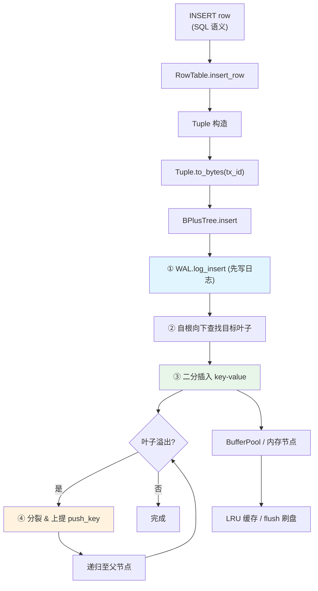
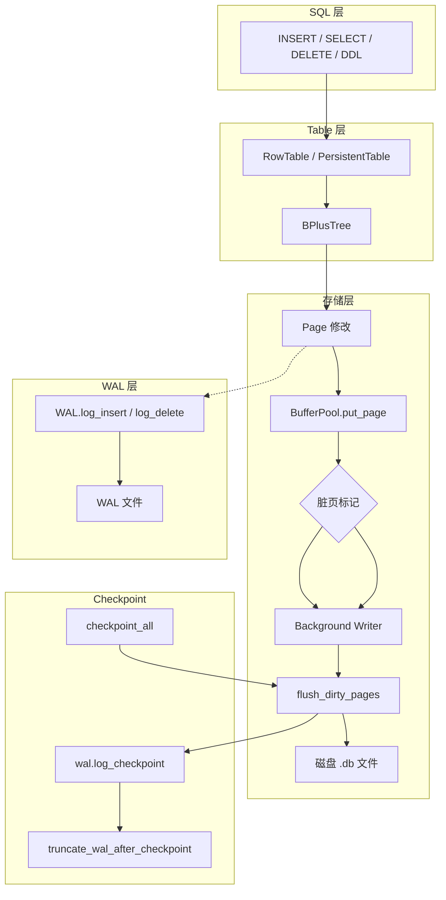
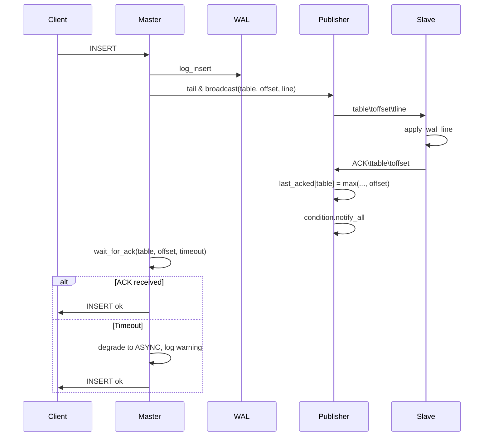
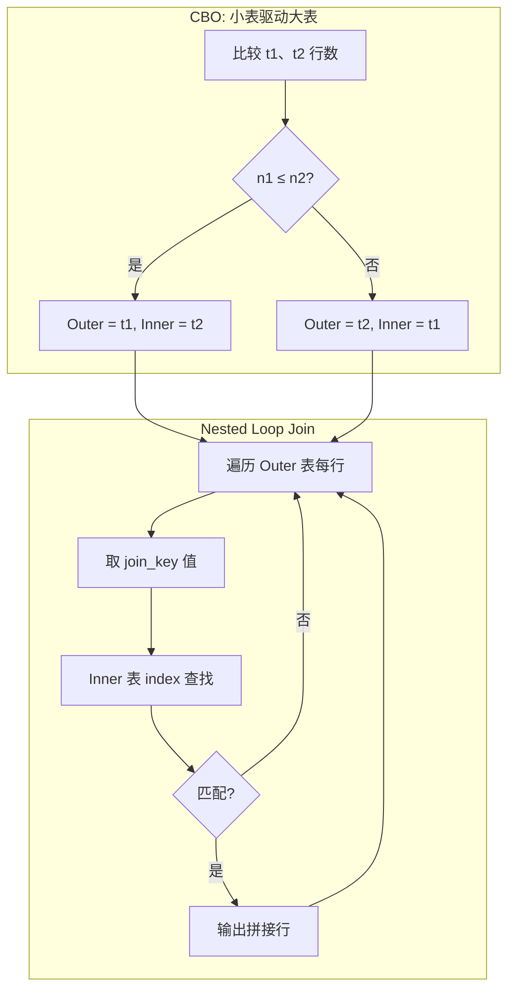

# PyBPlus-DBEngine 核心架构设计白皮书
# PyBPlus-DBEngine Core Architecture Design White Paper
# PyBPlus-DBEngine コアアーキテクチャ設計ホワイトペーパー

---

**Version**: 2.3  
**Date**: 2026  
**Status**: Phase 1–Phase 26b (AST Parser, Nested Loop Join)

---

## 目录 | Table of Contents | 目次

1. [Architecture Overview | 架构概览 | アーキテクチャ概要](#1-architecture-overview)
2. [B+ Tree Mechanics | B+ 树机制 | B+ 木メカニクス](#2-b-tree-mechanics)
3. [Persistence & Reliability | 持久化与可靠性 | 永続化と信頼性](#3-persistence--reliability)
4. [Concurrency & MVCC | 并发与多版本 | 並行性と MVCC](#4-concurrency--mvcc)
5. [Relational Layer | 关系层 | リレーショナルレイヤー](#5-relational-layer)
6. [Data Flow Diagram | 数据流图 | データフロー図](#6-data-flow-diagram)
7. [Performance Report | 性能报告 | パフォーマンスレポート](#7-performance-report)
8. [Phase 10: High Performance & Optimization | Phase 10：高级性能优化](#8-phase-10-high-performance--optimization)
9. [Phase 11-14: Logic Closure & Physical Optimization | Phase 11-14：逻辑闭环与物理优化](#9-phase-11-14-logic-closure--physical-optimization)
10. [Phase 15: Wire Protocol & SQL Execution | Phase 15：Wire Protocol 与 SQL 执行流程](#10-phase-15-wire-protocol--sql-execution)
11. [Phase 16: Recovery & DDL | Phase 16：恢复与数据定义语言](#11-phase-16-recovery--ddl)
12. [Phase 17: System Integrity Closure | Phase 17：系统完整性合拢](#12-phase-17-system-integrity-closure)
13. [Phase 18: Query Enhancement & Observability | Phase 18：查询优化与可观测性](#13-phase-18-query-enhancement--observability)
14. [Phase 19: Concurrency, Stress & Savepoints | Phase 19：并发、压力测试与保存点](#14-phase-19-concurrency-stress--savepoints)
15. [Phase 21-22: Unified Persistence & Full MVCC | Phase 21-22：统一持久化与完整 MVCC](#15-phase-21-22-unified-persistence--full-mvcc)
16. [Phase 24: Query Profiling & WAL Replication | Phase 24：执行计划分析与主从同步](#16-phase-24-query-profiling--wal-replication)
17. [Phase 25: Cost Estimation & Auto-Failover | Phase 25：代价模型与自动故障转移](#17-phase-25-cost-estimation--auto-failover)
18. [Phase 26a: Semi-Sync Replication | Phase 26a：半同步复制与一致性增强](#18-phase-26a-semi-sync-replication)
19. [Phase 26b: AST Parser & Nested Loop Join | Phase 26b：AST 解析与嵌套循环关联](#19-phase-26b-ast-parser--nested-loop-join)

---

## 1. Architecture Overview
## 架构概览
## アーキテクチャ概要

### 1.1 Page-based Storage
### 基于页的存储
### ページベースストレージ

| 項目 | Value | 说明 |
|------|-------|------|
| **PAGE_SIZE** | 4096 bytes | 4KB 固定页，与主流 OS 页面对齐 |
| **File Header** | 16 bytes | `B+DB` magic (4B) + root_page_id (4B) + next_page_id (4B) |
| **Page Layout** | offset = 16 + page_id × 4096 | 页在文件中的物理偏移 |

**Layout**: ファイルは「16バイトヘッダ + 4096バイト × N ページ」の構造を採用。各ページは B+ 木のノードに対応し、ディスク I/O の単位となる。

### 1.2 Buffer Pool Design
### 缓冲池设计
### バッファプール設計

```
┌─────────────────────────────────────────────────────────┐
│  LRU Cache (OrderedDict)                                │
│  page_id → (raw_bytes, is_dirty)                        │
│  max_pages = 64                                         │
└─────────────────────────────────────────────────────────┘
         │                    │
         ▼                    ▼
   get_page()           put_page()
   (read path)          (write path)
         │                    │
         │  miss: 从磁盘读取    │  dirty: 刷回时写入
         ▼                    ▼
   _read_page_from_disk   _write_page_to_disk
```

**Key mechanisms** / **核心机制** / **コアメカニズム**:
- **LRU eviction**: 最久未用页优先淘汰；脏页先刷回磁盘再淘汰
- **Atomic flush**: 先写临时文件 `.tmp`，`os.replace()` 原子覆盖，崩溃安全
- **Dirty tracking**: 修改过的页标记为 dirty，flush 时批量持久化

---

## 2. B+ Tree Mechanics
## B+ 树机制
## B+ 木メカニクス

### 2.1 Node Structure
### 节点结构
### ノード構造

| Node Type | keys | children / values | B-Link | 説明 |
|-----------|------|-------------------|--------|------|
| **InternalNode** | sorted keys | n+1 children | high_key, right_sibling | 内部ノード：キーによるルーティング |
| **LeafNode** | sorted keys | values (key-value pairs) | high_key, right_sibling | 葉ノード：双方向 next リンク |

**Order**: デフォルト order=4 → `MAX_KEYS=4`, `MIN_KEYS=2`。叶子溢出时触发分裂，欠键时触发再平衡。**B-Link**：各节点含 `high_key`（键上界）与 `right_sibling`（分裂产生的右兄弟链）。

### 2.2 Split Algorithm
### 分裂算法
### 分割アルゴリズム

**Leaf Split** (`_split_leaf`):
1. 中点 `mid = (n+1)//2`，左取 ceil(n/2) 个 key
2. 右叶子取 keys[mid:], values[mid:]
3. **Push key** = 右半最左 key（复制上提，保留于叶中，B+ 树规范）
4. 维护 prev/next 双向链表

**Internal Split** (`_split_internal`):
1. 中点 `mid = n//2`，`push_key = keys[mid]` 上提
2. 右内部节点取 keys[mid+1:], children[mid+1:]（中间键不再保留于当前层）
3. 左截断为 keys[:mid], children[:mid+1]

### 2.3 Merge & Rebalance
### 合并与再平衡
### マージとリバランス

**Borrow**: 优先向左/右兄弟借位（`len(sibling.keys) > MIN_KEYS`），避免合并。

**Merge**:
- 叶子：与左/右兄弟合并，更新父的 keys 与 children
- 内部节点：合并后若父欠键，递归 `_rebalance_parent`
- 根收缩：根仅剩一子时，子提升为新根，树高 -1

### 2.4 Latch Crabbing (Lock Crabbing)
### 锁螃蟹算法
### ラッチクラッピング

**Principle** / **原则** / **原理**:
- 向下遍历时，锁住当前节点，再释放祖先（仅当当前节点“安全”时）
- **Safe for insert**: `len(keys) < MAX_KEYS`，再插一个不会分裂
- **Safe for delete**: `len(keys) > MIN_KEYS`，再删一个不会合并

**Implementation**: `LatchManager` 为每节点维护 `RLock`；`CrabbingGuard` 在子节点安全时释放祖先锁。当前 BPlusTree 使用树级 `TreeLatch`（`read_guard` / `write_guard`）提供粗粒度并发，可扩展为细粒度 per-node crabbing。

---

## 3. Persistence & Reliability
## 持久化与可靠性
## 永続化と信頼性

### 3.1 Binary Page Layout
### 二进制页布局
### バイナリページレイアウト

**Internal Page**:
```
header(16): type(1)=0, key_count(2), parent_id(4)
keys(n×8): int64 little-endian
children((n+1)×4): int32 page_ids
[padding to 4096]
```

**Leaf Page (Legacy)**:
```
header(16): type(1)=1, key_count(2), parent_id(4)
keys(n×8): int64
prev_id(4), next_id(4): 叶链表
values: per value [len(2) + utf8_bytes]
[padding to 4096]
```

**Leaf Page (Slotted, Phase 12)**：
```
header(24): type(2), key_count, parent_id, prev_id, next_id, slot_array_end, free_start
SlotArray(4×n): 每 slot [offset(2), length(2)]
Free Space
Records(从页尾向页头): 每条 [key(8) + value_len(2) + value]
```
详见 `docs/SLOTTED_PAGE_LAYOUT.md`。

### 3.2 Superblock (Page 0)
### 超级块（页 0）
### スーパーブロック（ページ0）

持久化表使用 Page 0（4096 bytes）存储元数据：
- magic `DBT1`
- schema JSON、primary_key、order
- primary_root_id、secondary_index roots
- 其余为 JSON 形式的主/二级索引数据

### 3.3 WAL & Atomic Commit
### WAL 与原子提交
### WAL とアトミックコミット

**Format**:
```
TX_BEGIN <tx_id>
TX<tx_id> INSERT <key> <base64_value>
TX<tx_id> DELETE <key>
COMMIT <tx_id>
```

**Recovery**: 仅重放 **已 COMMIT** 的事务；未提交的 TX_BEGIN… 序列被丢弃，实现原子提交语义。

---

## 4. Concurrency & MVCC
## 并发与多版本
## 並行性と MVCC

### 4.1 Record Header
### 行头
### レコードヘッダ

每行前缀 20 字节：
- `RHD1` (4B) 魔数
- `transaction_id` (8B)
- `roll_pointer` (8B)，预留给 Undo Log

### 4.2 ReadView Visibility (深度解析)
### ReadView 可见性（深度解析）
### ReadView 可視性（詳細解析）

**问题**: 多版本并发下，某物理行的 `row_tx_id` 表示创建该行的事务。读者需要判断：是否应看到该版本？

**ReadView 三要素**:
- `creator_tx_id`: 创建该视图的读者事务 ID
- `committed`: 已提交事务 ID 集合
- `active_ids`: 快照时刻尚未提交的事务 ID 集合

**可见性判定**（`row_tx_id` 过滤机制）:

行对 ReadView 可见 ⟺ 以下三条同时满足：

1. **row_tx_id ∈ committed**  
   创建该行的事务必须已提交。

2. **row_tx_id ≤ creator_tx_id**  
   行的创建者不能晚于读者；读者不应看到“未来”数据。

3. **row_tx_id ∉ active_ids**  
   已提交则必不在 active；此条为双重保险。

**公式化**:
$$\text{visible}(row) \iff row\_tx\_id \in \text{committed} \,\wedge\, row\_tx\_id \leq creator\_tx\_id$$

---

## 5. Relational Layer
## 关系层
## リレーショナルレイヤー

### 5.1 Schema Serialization
### Schema 序列化
### スキーマシリアライズ

| 类型 | 格式 | サイズ |
|------|------|--------|
| INT | `struct.pack("<q", v)` | 8B |
| FLOAT | `struct.pack("<d", v)` | 8B |
| VARCHAR(N) | `len(2B) + utf8` | 2B + variable |

行格式：`[RHD1][tx_id 8B][roll_ptr 8B][payload]`

### 5.2 Secondary Index
### 二级索引
### セカンダリインデックス

- **Key**: `(field_value, primary_key)` 复合键，支持同字段多行
- **Value**: 占位 1（或主键引用）
- **插入/删除**: 主表变更时同步更新所有二级索引
- **get_by_index**: 有索引时 O(log N) 查找主键，再回表（Bookmark Lookup）取全行

---

## 6. Data Flow Diagram
## 数据流图
## データフロー図

以下流程图展示一条 INSERT 从 SQL 语义到写入 WAL、再更新 B+ 树的完整生命周期。



---

## 7. Performance Report
## 性能报告
## パフォーマンスレポート

### 7.1 Benchmark Setup
### 测试环境
### ベンチマーク環境

- 随机插入：100,000 条
- 范围查询：`[40_000, 49_999]` 约 10,000 条
- B+ 树 order=64（减小层数以优化插入）

### 7.2 Results
### 结果
### 結果

| 场景 / Scenario | BPlusTree | dict |
|-----------------|-----------|------|
| 随机插入 100k | ~870 ms | ~31 ms |
| 范围查询 10k | **~7 ms** | ~27 ms |

### 7.3 Analysis
### 分析
### 分析

**插入**: dict 在纯内存、无结构维护开销下更快；B+ 树需维护顺序与分裂，插入成本更高。

**范围查询**: B+ 树 **约 3.8× 更快**。
- B+ 树：沿叶子 `next` 链顺序扫描，**O(k)** 其中 k 为范围内记录数，无需全表过滤与排序
- dict：需全表遍历过滤 + 排序，**O(N log N)** 其中 N 为总记录数

**结论 / Conclusion / 結論**:  
B+ 树在范围查询场景下对原生 dict 具有明显优势，适合 OLAP 式批量扫描与区间检索，体现索引结构的核心价值。

---

## 8. Phase 10: High Performance & Optimization
## Phase 10：高级性能优化
## Phase 10：ハイパフォーマンスと最適化

### 8.1 B-Link Tree 雏形
### B-Link Tree 雏形
### B-Link Tree プロトタイプ

为 B+ 树节点引入 **high_key** 与 **right_sibling**，为高并发插入铺路。

| 属性 | 含义 |
|------|------|
| **high_key** | 该节点内键的上界；分裂后用于路由 |
| **right_sibling** | 分裂产生的右兄弟指针；父节点更新前可沿链找到新区 |

分裂时：左节点 `right_sibling = 右兄弟`，`high_key = push_key`；右节点 `high_key = max(keys)`。父节点插入后更新 `high_key = max(keys)`。

### 8.2 Free Space Map (FSM)
### 空闲空间映射
### 空き領域マップ

- **FreeSpaceMap**：用集合（逻辑位图）追踪已释放的 page_id
- **BufferPool.allocate_page**：优先从 FSM 复用空闲页，否则 `next_page_id++` 追加
- **BufferPool.free_page**：将页归还 FSM，供后续 allocate 复用

### 8.3 Cost-Based Optimizer (CBO-Lite)
### 代价优化器（轻量版）
### コストベースオプティマイザ（ライト版）

- **统计信息**：`_total_rows`（insert 时递增）、`_index_unique_counts`（预留）
- **choose_strategy(start_key, end_key)**：
  - 若 `scan_range / total_rows > 0.3` → `TABLE_SCAN`
  - 否则 → `INDEX_SCAN`
- **refresh_stats()**：从范围扫描重新计算 `total_rows`（如加载后）

---

## 9. Phase 11-14: Logic Closure & Physical Optimization
## Phase 11-14：逻辑闭环与物理优化
## Phase 11-14：ロジッククロージャと物理最適化

### 9.1 Phase 11：FSM 闭环与 CBO 联动
### Phase 11：FSM 闭环与 CBO 联动

- **FSM 闭环**：在 `tree.py` 的 merge 逻辑（`_merge_leaf_left/right`、`_merge_internal_left/right`）、根收缩、空树删除时，调用 `_try_free_discarded_node()`，将废弃页归还 `BufferPool.free_page()`。
- **load_from_db(keep_pool=True)**：树保留 pool 与 node_to_pid 映射，使 merge 时可正确释放页。
- **CBO 联动**：`scan_with_condition` 根据 `choose_strategy` 自动选择 `TABLE_SCAN` 或 `INDEX_SCAN`；`TABLE_SCAN` 时全表扫描并在条件中过滤用户 key 范围。

### 9.2 Phase 12：Slotted Page 物理布局
### Phase 12：Slotted Page 物理布局

- **布局**：Header(24B) | SlotArray | Free Space | Records（从页尾向页头生长）。
- **碎片整理**：`_compact_slotted_page()` 回收逻辑删除产生的空隙。
- **字节级定义**：见 `docs/SLOTTED_PAGE_LAYOUT.md`。

### 9.3 Phase 13：Undo Log 物理回滚
### Phase 13：Undo Log 物理回滚

- **UndoRecord**：`op`(INSERT/DELETE)、`key`、`before_image`、`after_image`。
- **流程**：`insert_row`/`delete_row` 在修改前调用 `transaction.log_insert_undo` / `log_delete_undo`。
- **rollback(tree)**：逆序应用 Undo 记录：INSERT 回滚 → delete(key)；DELETE 回滚 → insert(key, before_image)。
- **RowTable.rollback_transaction(tx)**：对表执行物理回滚。

### 9.4 Phase 14：后台刷脏与 Checkpoint
### Phase 14：后台刷脏与 Checkpoint

- **BackgroundWriter**：守护线程定时调用 `pool.flush_dirty_pages()` 批量刷脏。
- **do_checkpoint(pool, wal)**：刷写全部脏页，记录 `CHECKPOINT`。
- **truncate_wal_after_checkpoint(wal_path)**：截断 WAL，仅保留最后 CHECKPOINT 之后内容。

### 9.5 Undo/Redo 恢复逻辑
### Undo/Redo 恢复逻辑

| 机制 | 作用 |
|------|------|
| **WAL** | 修改前记录 INSERT/DELETE；崩溃后 Replay 重放已提交事务 |
| **Undo Log** | 修改前记录 before_image；回滚时逆序还原 Page 数据 |
| **Checkpoint** | 脏页刷盘后截断 WAL，缩短恢复时间 |

---

## 10. Phase 15: Wire Protocol & SQL Execution
## Phase 15：Wire Protocol 与 SQL 执行流程
## Phase 15：Wire Protocol と SQL 実行フロー

### 10.1 Wire Protocol
### 有线协议
### ワイヤプロトコル

| 方向 | 格式 | 说明 |
|------|------|------|
| **请求 Request** | `[4B length LE][UTF-8 SQL]` | length = payload 字节数 |
| **响应 Response** | `[4B length LE][UTF-8 text]` | 格式：`STATUS\nmessage\n[header\nrow1\n...]` |

- **STATUS**：`OK` 或 `ERROR`
- **message**：状态描述（如 `(3 rows)` 或错误信息）
- **header/row**：SELECT 时，表头与行均为 TAB 分隔

### 10.2 SQL 解析器 (Parser Lite)
### SQL Parser Lite

- **支持语句**：`SELECT * FROM t [WHERE id>=x AND id<=y]`、`INSERT INTO t (c1,c2) VALUES (v1,v2)`、`DELETE FROM t WHERE id=v`
- **实现**：`sql_engine.py`，正则与字符串切分，输出 `ParsedSelect` / `ParsedInsert` / `ParsedDelete`
- **映射**：`execute_sql()` 调用 `RowTable.scan_with_condition` / `insert_row` / `delete_row`

### 10.3 多线程 TCP 服务器
### 多线程 TCP サーバー

- **实现**：`socketserver.ThreadingTCPServer`，每连接一个 `DBRequestHandler` 线程
- **每连接独立事务**：`BEGIN` 开启、`COMMIT` 提交、`ROLLBACK` 物理回滚
- **启动**：`scripts/run_server.py -H 127.0.0.1 -P 8765`

### 10.4 交互式 CLI 客户端
### 対話型 CLI クライアント

- **脚本**：`scripts/cli_client.py -H host -P port`
- **用法**：类似 `mysql -u root`，输入 SQL，表格形式输出
- **命令**：`QUIT` / `EXIT` 断开连接

### 10.5 SQL 执行流程
### SQL 実行フロー

```
Client                    Server                     RowTable
   |                         |                            |
   |--[Length][SQL]--------->|                            |
   |                         |-- parse_sql(sql)           |
   |                         |-- execute_sql(table,tx)    |
   |                         |   |-- insert_row /         |
   |                         |   |   scan_with_condition/ |
   |                         |   |   delete_row --------->|
   |                         |<-- (msg, rows, cols) ------|
   |<-[Length][OK\n...]------|                            |
```

---

## 11. Phase 16: Recovery & DDL
## Phase 16：恢复与数据定义语言
## Phase 16：リカバリと DDL

### 11.1 Recovery Algorithm | 恢复算法 | リカバリアルゴリズム

- **目标**：服务器崩溃后，启动时自动重放 WAL，使内存与磁盘保持一致。
- **触发**：`run_server_with_recovery(data_dir)` 时，若存在 `wal.log` 或 `wal_{table}.log`，则执行恢复。
- **流程**：`DatabaseContext.run_recovery()` → 按表查找 `wal_{name}.log` → 调用 `WAL.replay()` → 仅重放状态为 `COMMIT` 的事务中的物理操作（`INSERT`/`DELETE`）。
- **兼容**：无 Catalog 时，重放全局 `wal.log` 到第一个表；有 Catalog 时，每个表使用各自的 `wal_{name}.log`。

| 步骤 | 说明 |
|------|------|
| 1. 加载 Catalog | 从 `catalog.json` 读取表列表与 Schema |
| 2. 加载表 | 为每个表创建 `RowTable`，打开对应数据文件 |
| 3. WAL 重放 | 对每个表重放 `wal_{name}.log`（若存在） |
| 4. 启动服务 | 进入正常请求处理循环 |

### 11.2 DDL Handling | DDL 处理 | DDL 処理

- **CREATE TABLE**：`CREATE TABLE name (col1 INT, col2 VARCHAR(32), ...)`，支持 `PRIMARY KEY (col)` 或 `col INT PRIMARY KEY`。
- **实现**：`sql_engine.py` 中 `_parse_create_table()` 解析列定义，`execute_sql()` 在传入 `DatabaseContext` 时调用 `db.create_table()`。
- **动态创建**：解析后创建 `RowTable`，写入 `catalog.json`，并为该表创建专用 `wal_{name}.log`。

| 语法 | 示例 |
|------|------|
| 列定义 | `id INT`, `name VARCHAR(32)` |
| 主键（列级） | `id INT PRIMARY KEY` |
| 主键（表级） | `PRIMARY KEY (id)` |

### 11.3 Metadata Persistence | 元数据持久化 | メタデータ永続化

- **存储**：`catalog.json` 保存 `{ table_name: { "fields": [...], "primary_key": "col" } }`。
- **加载**：`Catalog.load()` 在 `DatabaseContext` 初始化时执行，`load_tables()` 根据 Catalog 重建所有表。
- **效果**：服务器重启后，之前创建的表依然存在，数据可通过 `SELECT` 查询。

### 11.4 DBError & Robustness | 错误码与鲁棒性 | エラーコードとロバスト性

- **体系**：`errors.py` 中定义 `DBError` 基类，包含 `code`、`message`、`format_for_wire()`。
- **常用错误码**：`1064` 语法错误、`1065` 空 SQL、`1146` 未知表、`1050` 表已存在、`1054` 未知列、`1062` 重复键、`1032` 键不存在、`1049` 未知数据库、`1091` 表被占用（DROP 失败）、`1109` 不支持语句。
- **保护**：Server 捕获 `DBError`，通过 `format_for_wire()` 返回 `ERROR\n<code> <message>\n`，避免非法输入导致进程崩溃。

### 11.5 启动方式 | Startup Modes | 起動モード

| 模式 | 命令 | 说明 |
|------|------|------|
| 单表模式 | `run_server.py -T mytable` | 兼容旧版，无恢复、无 Catalog |
| 恢复模式 | `run_server.py -d ./data` | 加载 Catalog、执行 WAL 恢复、支持 DDL |
| 认证模式 | `run_server.py --password <pass>` | 客户端首条消息须为 `AUTH <pass>`，否则断开 |

---

## 12. Phase 17: System Integrity Closure
## Phase 17：系统完整性合拢
## Phase 17：システム整合性クロージャ

### 12.1 Global Transaction Rollback | 多表原子回滚 | マルチテーブル原子ロールバック

- **数据结构**：`Transaction` 新增 `_involved_tables: set[RowTable]`，`UndoRecord` 新增 `table` 引用。
- **注册**：`insert_row` / `delete_row` 在有事务时调用 `tx.register_table(self)` 并传入 `table=self` 给 `log_insert_undo` / `log_delete_undo`。
- **回滚**：`tx.rollback()` 按 Undo 逆序（LIFO）遍历，每条记录携带 `table`，对 `table._tree` 执行物理还原；无 `table` 时兼容传入 `tree` 的旧接口。

### 12.2 DROP TABLE & Resource Reclamation | 物理资源回收 | 物理リソース回収

- **流程**：`DatabaseContext.drop_table(name)` → 从 `_tables` 移除 → `Catalog.remove_table()` → 删除 `wal_{name}.log` → 删除 `{name}.db` / `{name}.idx`（若存在）。
- **异常**：删除 WAL 时若 `PermissionError`（文件被占用），恢复表与 Catalog，抛出 `TableInUseError(1091)`。
- **持久化**：重启后 `load_tables()` 仅加载 Catalog 中表，被 DROP 的表不再出现。

### 12.3 WAL Truncation & Checkpoint | 日志截断 | WAL 截断

- **Checkpoint**：`DatabaseContext.checkpoint_all()` 对每个表执行 `_persist_tree_to_pool` → `pool.flush_all()` → `wal.log_checkpoint()` → `truncate_wal_after_checkpoint(path)`。
- **时机**：可由后台线程或手动调用；**Phase 21** 起采用 BufferPool + 每表 WAL，Checkpoint 前强制刷写全部脏页。

---

## 13. Phase 18: Query Enhancement & Observability
## Phase 18：查询优化与可观测性
## Phase 18：クエリ強化と観測可能性

### 13.1 SQL Aggregation & Modifiers | 聚合与修饰 | 集約と修飾

| 功能 | 语法 | 说明 |
|------|------|------|
| **ORDER BY** | `ORDER BY col [ASC\|DESC]` | 按列排序，默认 ASC |
| **LIMIT** | `LIMIT n` | 返回最多 n 行 |
| **OFFSET** | `OFFSET n` | 跳过前 n 行 |
| **COUNT(*)** | `SELECT COUNT(*) FROM t` | 聚合返回行数 |

### 13.2 Observability | 可观测性 | 観測可能性

| 命令 | 输出 |
|------|------|
| **SHOW TABLES** | 表名列表（需 DatabaseContext） |
| **SHOW STATS** | Buffer Pool 命中率、活跃事务数、各表文件字节数 |
| **SHOW HEALTH** | 返回 `OK` 表示引擎正常（Phase 22） |

### 13.3 SQL Security | 安全防护 | セキュリティ

- **异常捕获**：`parse_sql` 捕获所有非 `DBError` 异常，统一转换为 `SQLSyntaxError(1064)`，保证畸形 SQL 不会导致进程崩溃。
- **VARCHAR 限制**：`CREATE TABLE` 中 `VARCHAR(N)` 的 N 不得超过 `MAX_VARCHAR_LENGTH`（默认 4096），超出则 `DataLimitError(1118)`。
- **INSERT 限制**：单次 INSERT 数据估算字节数不得超过 `MAX_INSERT_BYTES`（默认 1MB），超出则 `DataLimitError(1118)`。

---

## 14. Phase 19: Concurrency, Stress & Savepoints
## Phase 19：并发、压力测试与保存点
## Phase 19：並行性、ストレステストとセーブポイント

### 14.1 Savepoints | 事务保存点 | トランザクションセーブポイント

- **数据结构**：`Transaction._savepoints: dict[str, int]`，Key 为名称，Value 为 `undo_records` 长度快照。
- **SAVEPOINT name**：记录当前 `len(_undo_records)`。
- **ROLLBACK TO name**：逆序执行从当前到 `_savepoints[name]` 之间的 Undo，截断 `_undo_records`，删除该保存点及之后创建的保存点。

### 14.2 Server Robustness | 连接超时与清理 | 接続タイムアウトとクリーンアップ

- **Timeout**：`socket.settimeout(60.0)`，客户端 60 秒无响应则 `recv` 抛出 `socket.timeout`。
- **Cleanup**：捕获 `socket.timeout` 后，若有未提交事务则强制 `rollback()` 并断开连接。

### 14.3 Concurrency Benchmark | 并发压力测试 | 並行ストレステスト

- **脚本**：`scripts/benchmark_concurrency.py`
- **配置**：20 客户端、30 秒、随机 INSERT / SELECT COUNT(*)
- **用法**：先启动 `run_server_with_recovery -d ./data`，再运行 `python benchmark_concurrency.py`
- **验证**：无死锁、无数据损坏；COUNT(*) 符合 Read Committed 一致性。

---

## 15. Phase 21-22: Unified Persistence & Full MVCC
## Phase 21-22：统一持久化与完整 MVCC
## Phase 21-22：統一永続化とフル MVCC

### 15.1 统一持久化架构 | Unified Persistence Architecture | 統一永続化アーキテクチャ

**核心变更**：废弃纯内存 B+ 树模式。`DatabaseContext` 启动时初始化 `BufferPool` 和 `PersistentTable`，所有 SQL 操作经统一持久化路径落盘。

**架构图**：



**数据流**：
- SQL → Table → B+ 树 → Page 修改 → 标记 Dirty Page → Background Writer 异步刷盘
- Checkpoint 时：`flush_all()` 强制刷写全部脏页 → `wal.log_checkpoint()` → 截断 WAL

### 15.2 MVCC 深度接入 | Full MVCC Integration | フル MVCC 統合

- **ReadView 绑定**：`SELECT` 开始时，执行器自动获取当前 `Transaction` 的 `ReadView`。
- **可见性判断**：查询路径中每一行读取均经过 `mvcc.is_visible()` 过滤。
- **隔离级别**：默认 **Read Committed**，读不阻塞写。

### 15.3 安全基线 | Security Baseline | セキュリティベースライン

- **简单认证**：`--password <pass>` 启动参数，客户端连接后首条指令必须为 `AUTH <password>`。
- **协议握手**：认证失败返回 `[1045] Authentication required` 并断开连接。

### 15.4 DevOps 与健康检查 | DevOps & Health Check | DevOps とヘルスチェック

| 功能 | 说明 |
|------|------|
| **Dockerfile** | 基于 `python:3.10-slim` 的生产级镜像；`CMD` 使用 `run_server.py -H 0.0.0.0 -P 8765 -d /data` |
| **SHOW HEALTH** | 返回 `OK` 与 `[["status","OK"]]`，表示引擎正常运行 |

### 15.5 存储格式兼容 | Storage Format Compatibility | ストレージフォーマット互換

- **Leaf Page value**：Slotted 页的 value 支持 `bytes` 二进制存储（RowTable 行格式为 `RHD1` + 序列化字段），保证 `deserialize_row` 与持久化一致。

---

## 16. Phase 24: Query Profiling & WAL Replication
## Phase 24：执行计划分析与主从同步
## Phase 24：実行計画分析とマスタースレーブ複製

### 16.1 轻量级 EXPLAIN | Lightweight EXPLAIN | 軽量 EXPLAIN

- **语法**：`EXPLAIN <SQL>`，支持 SELECT、INSERT、DELETE、CREATE TABLE、DROP TABLE。
- **输出**：
  - **Query Type**：SELECT / INSERT / DELETE / CREATE TABLE / DROP TABLE
  - **Execution Strategy**：TABLE_SCAN 或 INDEX_SCAN（基于 CBO-Lite）
  - **Scan Range**：索引扫描时显示 `[start_key, end_key]`，全表扫描为 FULL
  - **Filter Predicates**：WHERE 条件下推情况

### 16.2 主从同步原型 | Master-Slave Replication Prototype | マスタースレーブ複製プロトタイプ

| 角色 | 参数 | 说明 |
|------|------|------|
| **Master** | `--replication-port 8767` | 在端口 8767 接受 Slave 连接，推送 WAL 流 |
| **Slave** | `--slave-of 127.0.0.1:8767` | 连接 Master，接收 WAL 并实时重放 |

**数据流**：Master 的 WAL 尾读线程定期轮询 `wal_*.log`，将新增记录以 `table\toffset\tline` 格式（Phase 26a：offset 为字节偏移）推送给已连接的 Slave。Slave 解析、重放后回发 `ACK\t{table}\t{offset}`；半同步模式下 Master 等待 ACK 后再向客户端返回成功。

### 16.3 运维指标增强 | Operations Metrics | オペレーションメトリクス

`SHOW STATS` 新增：
- **node_role**：MASTER / SLAVE / STANDALONE
- **replication_lag**：Slave 与上次接收 WAL 的时间差（秒）

### 16.4 一键启动集群 | One-Click Cluster | ワンクリッククラスタ

```bash
./scripts/start_cluster.sh
```

启动一主一从（Master 8765 + 复制 8767，Slave 8766），使用 `data_master`、`data_slave` 独立数据目录。

---

## 17. Phase 25: Cost Estimation & Auto-Failover
## Phase 25：代价模型与自动故障转移
## Phase 25：コスト推定と自動フェイルオーバー

### 17.1 基于代价的优化模型 | Cost-Based Optimization Model | コストベース最適化モデル

**统计信息 (TableStats)**：
- `total_rows`：表总行数（insert/delete 时更新，refresh_stats 重算）
- `index_cardinality`：索引唯一值数（主键场景等于 total_rows）

**代价公式**：
```
Cost_TableScan = total_rows × 1.0
Cost_IndexScan = estimated_range_rows × 0.5 + 10   (10 为索引寻道常数)
```

**决策规则**：
- 若 `Cost_IndexScan > Cost_TableScan`，强制 TABLE_SCAN
- 否则，若 `estimated_range / total_rows > 0.3`，TABLE_SCAN
- 其余情况走 INDEX_SCAN

**EXPLAIN 输出增强**：新增 `Cost_TableScan`、`Cost_IndexScan`、`Estimated_Range_Rows` 行。

### 17.2 自动故障转移 | Auto-Failover | 自動フェイルオーバー

- **Health Check**：Slave 监控线程每 0.2 秒检查一次；若自上次接收 WAL 起超过 5 秒无心跳，触发 `promote_to_master()`。
- **角色切换**：`promote_to_master()` 停止订阅、将 `node_role` 设为 MASTER；提升后的实例可接受客户端写请求并写入本地 WAL。
- **可配置超时**：`ReplicationSubscriber` 支持 `failover_timeout_sec` 参数（默认 5 秒）。

### 17.3 复杂 SQL 增强 | Complex SQL | 複雑 SQL 強化

- **WHERE col IN (val1, val2, ...)**：多值匹配，对主键列执行点查，利用索引。
- 解析 `col IN (v1, v2, v3)` 得到 `in_values`，扫描时对每个 value 调用 `tree.search(k)`。

---

## 18. Phase 26a: Semi-Sync Replication
## Phase 26a：半同步复制与写一致性增强
## Phase 26a：セミ同期レプリケーションと書き込み一貫性強化

### 18.1 半同步协议时序图 | Semi-Sync Protocol Sequence Diagram
### 半同期プロトコルシーケンス図



**说明**：Master 在返回客户端成功前，若启用半同步模式，则需在 Condition Variable 上阻塞，直至收到至少一个 Slave 对当前 WAL 偏移量的 ACK；超时（默认 100ms）则自动降级为异步并记录告警。

### 18.2 Slave ACK 机制 | Slave ACK Mechanism | スレーブ ACK メカニズム

| 组件 | 行为 |
|------|------|
| **ReplicationSubscriber** | 成功重放一条 WAL 后，立即向 Master 发送 `ACK\t{table}\t{offset}\n` |
| **消息格式** | 从 `table\tline` 升级为 `table\toffset\tline`，offset 为 WAL 文件字节位置 |
| **ReplicationPublisher** | 独立 `_ack_receiver` 线程，使用 `select` 从 Slave 连接读取 ACK，更新 `last_acked[table]` |

### 18.3 Master 等待逻辑 | Master WAIT_FOR_SLAVE Logic | マスター待機ロジック

| 配置 | 值 | 说明 |
|------|-----|------|
| **replication_timeout** | 100ms（默认） | 等待 ACK 超时时间 |
| **超时处理** | 自动降级 | 超时后设置 `replication_type = 'ASYNC'`，记录 `logging.warning` |
| **调用点** | `execute_sql` INSERT 分支 | 在 `tbl.insert_row` 成功后，若 `replication_type == 'SEMI_SYNC'` 则调用 `wait_for_ack` |

### 18.4 一致性折中方案 | Consistency Trade-off | 一貫性トレードオフ

| 模式 | 延迟 | 一致性 | 适用场景 |
|------|------|--------|----------|
| **ASYNC** | 低 | 最终一致 | 高吞吐、可容忍短暂主从落后 |
| **SEMI_SYNC** | 中等（+ 网络 RTT） | 至少一从已持久 | 强一致读从库、故障切换零丢失 |

**折中要点**：
- 半同步保证：客户端收到成功时，至少一个 Slave 已重放该 WAL 偏移量；主库宕机时，提升该从库可避免数据丢失。
- 代价：写延迟增加约 1 RTT；无 Slave 连接时超时降级，避免无限阻塞。
- SQL 切换：`SET GLOBAL replication_type = 'SEMI_SYNC' | 'ASYNC'` 支持运行时切换。

### 18.5 SQL 语法支持 | SQL Syntax Support | SQL 構文サポート

```
SET GLOBAL replication_type = 'SEMI_SYNC'
SET GLOBAL replication_type = 'ASYNC'
```

---

## 19. Phase 26b: AST Parser & Nested Loop Join
## Phase 26b：基于 AST 的解析重构与关联查询试点
## Phase 26b：AST ベースのパースリファクタリングと JOIN パイロット

### 19.1 基于 AST 的执行计划树 | AST-Based Execution Plan Tree
### 基于 AST の実行計画ツリー

**Parse → Plan → Execute 三阶段**：

```
┌─────────────┐     ┌──────────────────┐     ┌─────────────────┐
│   Parse     │ ──► │      Plan        │ ──► │    Execute      │
│ (sqlglot)   │     │ (ParsedSelect/   │     │ (scan/join/     │
│ SELECT/INSERT│    │  ParsedInsert)   │     │  insert)        │
└─────────────┘     └──────────────────┘     └─────────────────┘
```

- **Parse**：使用 sqlglot 解析 SELECT、INSERT，生成 AST；从 AST 提取字段、表名、WHERE、JOIN 条件。
- **Plan**：ParsedSelect / ParsedInsert 即为执行计划；JOIN 时含 join_tables、join_on。
- **Execute**：单表走 scan_with_condition；JOIN 走 _execute_join（Nested Loop）。

SHOW TABLES、SAVEPOINT 等仍用正则解析；SELECT/INSERT 优先 AST，失败时回退正则。

### 19.2 Nested Loop Join 物理执行过程 | Nested Loop Join Physical Execution
### ネステッドループ JOIN 物理実行プロセス



**说明**：
- 外层循环遍历小表（Outer），内层按 join 键在另一表（Inner）上做 `tree.search` 索引查找。
- 语法：`SELECT t1.a, t2.b FROM t1 JOIN t2 ON t1.id = t2.id`
- EXPLAIN 输出：Join Type、Outer Table、Inner Table、Join Condition、Cost_Outer、Cost_Inner_IndexLookup。

### 19.3 EXPLAIN JOIN 输出 | EXPLAIN JOIN Output
### EXPLAIN JOIN 出力

| 项 | 说明 |
|------|------|
| Query Type | SELECT (JOIN) |
| Join Type | NESTED_LOOP_JOIN |
| Outer Table | 小表（行数少） |
| Inner Table | 大表，按 join 键索引查找 |
| Join Condition | t1.id = t2.id |
| Cost_Outer | 外层全表扫描代价 |
| Cost_Inner_IndexLookup | 内层索引查找代价 |

---

## References
## 参考文献
## 参考文献

- PyBPlus-DBEngine 源码：`src/bplus_tree/`
- 基准脚本：`scripts/benchmark.py`、`scripts/benchmark_concurrency.py`
- 测试：`tests/test_*.py`

---

*Document generated from Phase 1–Phase 26b implementation.  
本白皮书基于 Phase 1 至 Phase 26b 的完整实现生成。  
Phase 1〜Phase 26b の実装に基づいて本ホワイトペーパーを生成しました。*

---

### 后续迭代建议 | Next Iteration Suggestions | 今後のイテレーション提案

| 优先级 | 方向 | 说明 |
|--------|------|------|
| **P2** | ALTER TABLE | 支持 `ADD COLUMN`、`DROP COLUMN`，需更新 Schema 与 Catalog |
| **P2** | 复杂主键 | 支持多列 `PRIMARY KEY (a, b)` |
| **已完成** | Checkpoint 优化 | Phase 21：脏页刷盘后截断 WAL，缩短恢复时间 |
| **P3** | 多数据库 | `USE database`、`CREATE DATABASE`，Catalog 按库分目录 |
| **P3** | 索引 DDL | `CREATE INDEX`、`DROP INDEX`，独立索引文件管理 |
